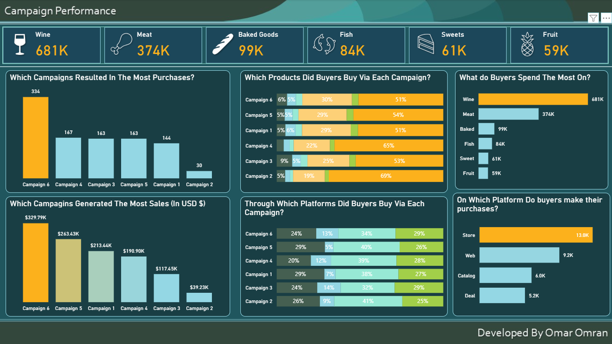
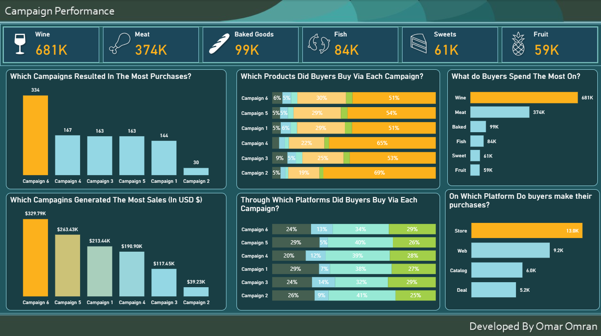
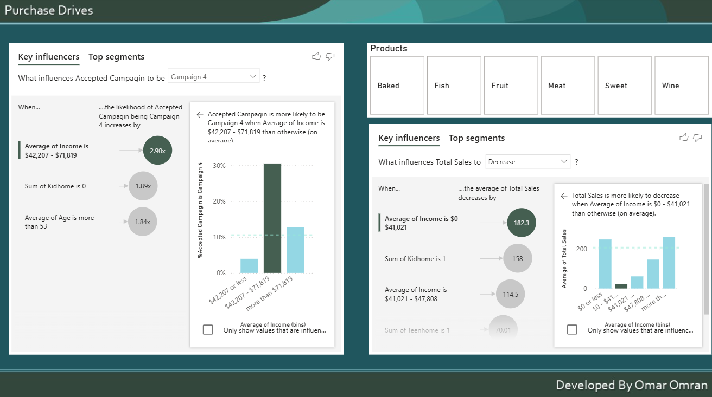

# 📊 Customer Behavior & Campaign Analysis (Power BI)

## 📌 Overview

This project analyzes customer demographics, purchasing behavior, and marketing campaign performance using Power BI.

The dashboard explores how different customer segments respond to campaigns and what factors influence purchasing decisions, helping identify key drivers of sales and customer engagement.

---

## 📸 Dashboard Preview

### 📈 Campaign Performance

### 👥 Buyer Composition

### 🧠 Purchase Drivers

---

## 🔍 Key Insights

* Campaign 6 generated the highest number of purchases and overall revenue
* Wine and Meat are the top-performing product categories across campaigns
* Store purchases dominate compared to web and catalog channels
* Higher income customers are more likely to respond positively to campaigns
* Customer demographics (age, income, family status) significantly influence purchasing behavior

---

## 📊 Key Features

* Multi-page dashboard with interactive filtering
* Campaign performance analysis (purchases & revenue)
* Customer demographic breakdown (age, income, marital status)
* Product category performance comparison
* Purchase channel analysis (store, web, catalog, deals)
* Key influencers visual to identify drivers of sales

---

## 🛠 Tools Used

* Power BI
* Power Query (data transformation)
* DAX (basic measures and calculations)

---

## 📁 Files Included

* '.pbix' file (Power BI dashboard)
* Dashboard screenshots
* Dataset (if included)

---

## 🚀 How to Use

1. Download the '.pbix' file
2. Open it using Power BI Desktop
3. Interact with filters and visuals to explore insights

---

## 👤 Author

Developed by **Omar Omran**

---
